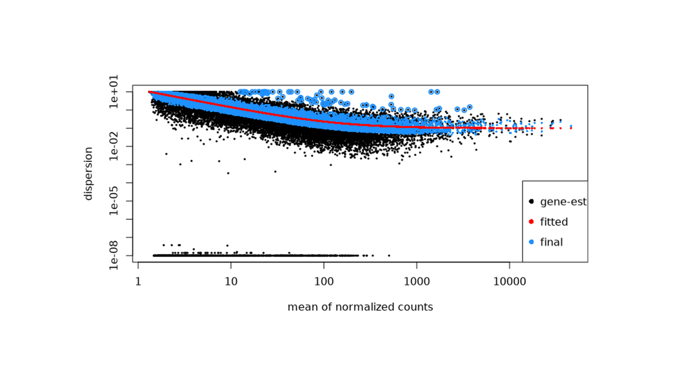
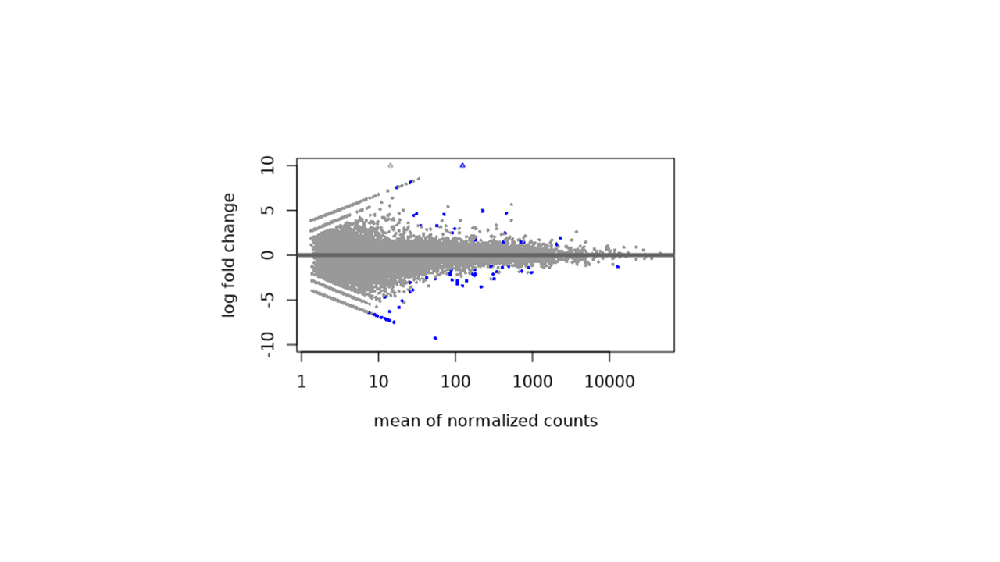
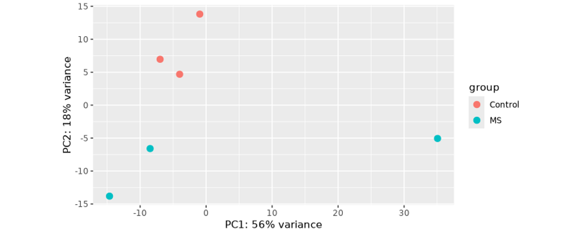

---
**Bulk RNA-seq Data and Differential Expression Analysis (DEA) on VSC Clusters**
---

by: Samaneh E. Tousi

## Table of Contents
- [Introduction to Bulk RNA-seq](#introduction-to-bulk-rna-seq)
- [Typical bioinformatics workflow of differential gene expression analysis](#typical-bioinformatics-workflow-of-differential-gene-expression-analysis)
- [Prerequisites](#prerequisites)
- [Step 1 – Access to VSC & Interactive Sessions](#step-1-access-to-vsc-interactive-sessions)
- [Step 2 – Connect, workspace, data](#step-2-connect-workspace-data)
- [Step 3 – Downsample FASTQ](#step-3-downsample-fastq)
- [Step 4 – QC & trimming (fastp)](#step-4-qc-trimming-fastp)
- [Step 5 – Mapping vs Aligning RNA-seq Reads](#step-5-mapping-vs-aligning-rna-seq-reads)
- [Step 6 – Strandness check](#step-6-strandness-check)
- [Step 7 – Quantifying Gene Expression by featureCounts](#step-7-quantifying-gene-expression-by-featurecounts)
- [Step 8 – MultiQC summary report](#step-8-multiqc-summary-report)
- [Step 9 – Differential expression analysis (DEA) and Enrichment analysis (GSEA)](#step-9-differential-expression-analysis-dea-and-enrichment-analysis-gsea)

---
<span style="color:purple; font-weight:600;">
Note: All questions are shown in purple for practice and self-assessment.
</span>
---

## Introduction to Bulk RNA-seq {#introduction-to-bulk-rna-seq}

Bulk RNA sequencing (bulk RNA-seq) is a high-throughput technique used to measure gene expression by capturing and sequencing the entire RNA content of a biological sample. Unlike single-cell RNA-seq, which analyzes individual cells, bulk RNA-seq measures the average transcriptomic profile of all cells combined. This makes it powerful for studying tissue-level changes, disease states, treatment effects, and biological pathways.

**what are the steps?**

1- RNA Extraction – Total RNA (or mRNA) is purified from tissue or cells.

2- Library Preparation – RNA molecules are fragmented, converted into cDNA, and barcoded using a specific library prep kit.

3- Sequencing – Prepared libraries are sequenced on a high-throughput platform (e.g., Illumina).

4- Bioinformatics Analysis – Reads are quality-checked, trimmed, aligned to a reference genome, counted per gene, and statistically evaluated for differential expression.


<a href="assets/Intro2RNAseq.pdf" target="_blank">**Read the reference, Pages 4-9, for more explanation**</a>


**Modalities of Bulk RNA-seq**

Bulk RNA-seq can be performed in different modalities, depending on what part of the transcriptome is captured:

**1. mRNA-seq (PolyA enrichment)**

Selects poly-A–tailed mRNA.

Captures mainly protein-coding genes.

Most common in human studies.

**2. Total RNA-seq (rRNA depletion)**

Removes rRNA and keeps all other RNA types.

Captures coding + noncoding RNAs (lncRNA, miRNA precursors, etc.).

Preferred for degraded samples (e.g., FFPE tissue).

**3. Strand-specific (directional) RNA-seq**

Preserves information about which DNA strand a transcript originated from.

Essential when antisense transcription or overlapping genes exist.

Common kits: NEBNext Ultra Directional, Illumina TruSeq Stranded.

**4. Single-end vs. Paired-end sequencing**

**Single-end (SE)**: sequence one end of each fragment
→ cheaper and sufficient for basic gene expression

**Paired-end (PE)**: sequence both ends
→ better for alternative splicing, isoform analysis, assembly


[**Read the reference, Paired-end vs Single-end sequencing (Illumina)**](https://www.illumina.com/science/technology/next-generation-sequencing/plan-experiments/paired-end-vs-single-read.html)

**Library Preparation Kits**

Different kits build RNA-seq libraries with distinct characteristics:

| **Kit Name**                         | **Type**      | **Strandness**   | **Use Case**                       |
| ------------------------------------ | ------------- | ---------------- | ---------------------------------- |
| **NEBNext Ultra II Directional RNA** | mRNA/total    | Reverse-stranded | Most common for human bulk RNA-seq |
| **Illumina TruSeq Stranded mRNA**    | PolyA mRNA    | Reverse-stranded | Gene expression, DE analysis       |
| **Illumina TruSeq Total RNA**        | rRNA-depleted | Reverse-stranded | Noncoding RNA, degraded samples    |
| **SMARTer Stranded Total RNA**       | FFPE-friendly | Forward-stranded | Clinical samples, low input        |
| **RiboZero kits**                    | rRNA-depleted | Reverse-stranded | Microbiome + host, broad coverage  |

These differences determine how reads should be interpreted and how tools like STAR, featureCounts, or kallisto handle strand orientation.

**Sequencing Platforms**
Most bulk RNA-seq data today is generated on Illumina platforms, which produce short, accurate reads with low error rates:

**Illumina NovaSeq**: very high throughput, large studies

**Illumina NextSeq**: medium throughput

**Illumina MiSeq**: smaller experiments, pilot studies

The different steps of sequencing with Illumina’s sequencing by synthesis method.


<a href="assets/Intro2RNAseq.pdf" target="_blank">**Read the reference, Page 8, for more explanation**</a>
 

## Typical bioinformatics workflow of differential gene expression analysis {#typical-bioinformatics-workflow-of-differential-gene-expression-analysis}


<a href="assets/Intro2RNAseq.pdf" target="_blank">**Read the reference, Page 17, for more explanation**</a>
  
## Prerequisites {#prerequisites}

- **Access to the VSC infrastructure**  
  (The Vlaams Supercomputer Centrum (VSC) is Flanders’ high-performance computing (HPC) platform that provides large-scale computing and storage resources for research.)
  
- **VSC account** with sufficient **computing credits (core hours)** to run jobs  
  (Credits measure how much computing time you are allowed to use. One core hour equals one CPU core running for one hour.)

- **Access to OnDemand and Interactive Apps** on the VSC portal

- **Basic familiarity with the Linux shell and R**

- **Storage space** under `$VSC_DATA` or on staging storage

---
### What is an HPC Node?

An **HPC node** (High-Performance Computing node) is a single powerful computer within the larger **VSC cluster**.  
Each node has:
- Multiple **CPU cores** (e.g., 64,72, 96, or more)
- Large **memory (RAM)**
- Access to **high-speed storage** and **shared file systems**

When you start an **interactive session** on VSC, you’re temporarily reserving a portion of one or more nodes (e.g., 1 node with 8 cores and 7.5 GB RAM per core).  
Think of it like booking a workstation on the supercomputer for a limited time to run your analysis.


For more information about the VSC system and its usage, please see:
- [VSC Training Resources](https://www.vscentrum.be/vsctraining)
- [HPC Introduction (GitHub)](https://github.com/hpcleuven/HPC-intro/blob/master/HPCintro.pdf)

---

## Step 1 - Access to VSC & Interactive Sessions {#step-1-access-to-vsc-interactive-sessions}

Request a VSC account and apply for introductory credits to run your own jobs. If you manage a research group, apply for project credits instead to get computing resources for your team.

-[Apply for your VSC account](https://docs.vscentrum.be/accounts/vsc_account.html#applying-for-your-vsc-account), Select **Hasselt University** when prompted.

-[Request introduction credits for your individual analysis](https://admin.kuleuven.be/icts/onderzoek/hpc/request-introduction-credits)

-[Request project credits if your project analysis lasts more than 6 months or multiple researchers in your research group require to analyse their data at VSC](https://admin.kuleuven.be/icts/onderzoek/hpc/request-project-credits)

-[Once your project group has been created and you have received your allocated core-hour credits for that and if your generating data exceeds 76 GB, you or your superviser should request staging storage for your group at VSC by specifying the required storage](https://admin.kuleuven.be/icts/onderzoek/hpc/hpc-storage)


Login to OnDemand, and click on **Partner organization** and select **Hasselt University**: [VSC OnDemand Portal](https://ondemand.hpc.kuleuven.be/)


Start **Interactive Shell** with:

- Cluster: *Wice*
- Partition: *interactive*
- Account:  *your own intro_VSC/project account*
- Number of hours: *2 h* or more
- Number of nodes: *1*
- Number of processes per node: *8*
- Number of cores per each task: *8*
- Required memory per core in megabytes: *7500 MB*

## Step 2 - Connect, workspace, data {#step-2-connect-workspace-data}

Connect to the running shell job (bottom Connect button). 
Once connected, use these commands to prepare your course workspace and load required software:

```
cd $VSC_DATA
mkdir -p Bioinfo_course && cd Bioinfo_course && pwd

# Load environment modules for this session
module load cluster/genius/interactive
module load SRA-Toolkit/3.0.5-gompi-2021a
```
Explanation:

**cd $VSC_DATA** → moves you into your personal storage directory on the cluster

**mkdir -p Bioinfo_course** → creates a folder for all course-related work

**cd Bioinfo_course** → enters that folder

**pwd** → confirms your current directory

**module load ...** → loads the tools needed for downloading and processing sequencing data

After this step, you’re ready to start downloading the example RNA-seq datasets in the next section.


### Dataset: GSE111972 (microglia, MS vs Control).
[Transcriptional profiling of human microglia in brain white matter of multiple sclerosis versus control samples](https://www.ncbi.nlm.nih.gov/geo/query/acc.cgi?acc=GSE111972)

For this analysis, we included three biological samples in each group, the minimum number needed for statistical analysis.


| sample_id | SRR        | condition | tissue               | layout     |
| --------- | ---------- | --------- | -------------------- | ---------- |
| MS_WM_1   | SRR6849240 | MS        | MS white matter      | Single-end |
| MS_WM_10  | SRR6849241 | MS        | MS white matter      | Single-end |
| MS_WM_11  | SRR6849242 | MS        | MS white matter      | Single-end |
| CON_WM_1  | SRR6849255 | Control   | Control white matter | Single-end |
| CON_WM_10 | SRR6849256 | Control   | Control white matter | Single-end |
| CON_WM_11 | SRR6849257 | Control   | Control white matter | Single-end |


**About GEO, SRA, and data identifiers**

The dataset we use in this tutorial comes from the Gene Expression Omnibus (GEO), a public repository hosted by NCBI that stores high-throughput functional genomics data, such as RNA-seq, ChIP-seq, and microarray experiments.

Each study submitted to GEO receives a GEO Series accession number, written as GSE######.

The GSE record describes the overall experiment, including metadata, design, and sample details.

Each sample within that study has its own GSM accession (GSM######), representing an individual biological replicate or condition.

GEO often provides a link to the Sequence Read Archive (SRA), where the actual raw sequencing reads are stored.
In SRA, each sequencing run has an SRR accession number (SRR######).

| Type    | Example    | Description                                       |
| ------- | ---------- | ------------------------------------------------- |
| **GSE** | GSE111972  | GEO *Series* — the entire study                   |
| **GSM** | GSM3045818 | GEO *Sample* — metadata for one biological sample |
| **SRR** | SRR6849240 | SRA *Run* — the actual sequencing file(s)         |


** From SRR to FASTQ **

The SRR files in SRA are stored in a binary format (.sra) to save space.
To work with them in RNA-seq tools, we first download these .sra files using prefetch, then convert them to standard FASTQ format using fasterq-dump from the SRA Toolkit.

Download:

```
OUT="$VSC_DATA/Bioinfo_course/MS_microglia_fastq"
mkdir -p "$OUT"
for SRR in SRR6849240 SRR6849241 SRR6849242 SRR6849255 SRR6849256 SRR6849257; do echo "Downloading $SRR ..."; prefetch "$SRR" && fasterq-dump -O "$OUT" -e 8 "$SRR" && pigz -p 8 "$OUT/${SRR}.fastq" || gzip -9 "$OUT/${SRR}.fastq"; done
```

** Checking and Understanding FASTQ Files**

Once your .fastq.gz files are downloaded from SRA, you can inspect their format and quality encoding directly from the command line.

**Preview your FASTQ file**

FASTQ files are text-based but usually compressed (.gz).
To peek inside without fully decompressing:

```
cd "$VSC_DATA/Bioinfo_course/MS_microglia_fastq"
zcat SRR6849240.fastq.gz | head
```
This prints the first few reads (each read spans 4 lines).

Example output:

```
@SRR6849240.1 1 length=76
CCTAGNTAATTTTTTGTATTTTTAGTCGAGACAGGGTTTCTCCATGTTGGTCAGGCTGGTCTCGAACTCCCGACCT
+SRR6849240.1 1 length=76
AAAAA#EEE/EEEEEEEEEEEEEEEEEEEEEEEEEEEAEEEEEEEEEEEEAEEEEEEEEEEE<EAEEEAEAE/<AA
```
<span style="color:purple; font-weight:600;">Question: Examine the FASTQ read above. Based on the sequence (A/C/T/G/N) and the quality string of ASCII symbols (A, E, /, <, #), what can you conclude about: 1-the presence of an “N” in the read, 2- the overall base-calling quality, 3- positions where sequencing quality drops, 4- and whether this read is likely to be kept or trimmed during QC?</span>

Each read is made up of four lines:

| Line | Description                                       | Example                     |
| ---- | ------------------------------------------------- | --------------------------- |
| 1    | **Read ID** (starts with `@`) — unique identifier | `@SRR6849240.1`             |
| 2    | **DNA sequence** — bases A, T, G, C, or N         | `CCTAGNTAATTTTTTGTATTTT...` |
| 3    | **Separator line**, starts with `+`               | `+SRR6849240.1`             |
| 4    | **Quality scores**, one symbol per base           | `AAAAA#EEE/EEEEEEEEEE...`   |


So, this record describes one sequenced fragment with:
76 nucleotides
76 corresponding quality characters

**Quality score line**

The 4th line (AAAAA#EEE/EEEE...) encodes the Phred quality score (Q) for each base, using [ASCII symbols](https://www.ascii-code.com/).

Each character corresponds to a numeric quality value:

**Q=ASCII code−33**

On the other word, Phred quality score (Q) quantifies the probability that a base was called incorrectly:

**Q=−10×log10​(Perror​)**

| Q score | Base call accuracy | Error probability | ASCII character (Illumina 1.8+) |
| ------- | ------------------ | ----------------- | ------------------------------- |
| 10      | 90%                | 1 in 10           | `+`                             |
| 20      | 99%                | 1 in 100          | `5`                             |
| 30      | 99.9%              | 1 in 1,000        | `?`                             |
| 40      | 99.99%             | 1 in 10,000       | `I`                             |


So, the higher the score → the more reliable that base call.

Illumina machines use Phred+33 encoding, meaning the ASCII code of the character minus 33 gives you the numeric quality score.

**Let’s decode a few examples**

| Character | ASCII code | Q score | Base call accuracy                         |
| --------- | ---------- | ------- | ------------------------------------------ |
| **C**     | 67         | 34      | 99.96% correct (1 error in ~2500 bases)    |
| **F**     | 70         | 37      | 99.98% correct (1 error in ~5000 bases)    |
| **H**     | 72         | 39      | 99.99% correct (1 error in ~8000 bases)    |
| **J**     | 74         | 41      | 99.99%+ correct (1 error in ~12,500 bases) |
| **E**     | 69         | 36      | 99.97% correct                             |
| **D**     | 68         | 35      | 99.97% correct                             |


| Character | ASCII | Q score | Accuracy |
| --------- | ----- | ------- | -------- |
| `A`       | 65    | 32      | 99.94%   |
| `E`       | 69    | 36      | 99.97%   |
| `#`       | 35    | 2       | 37%      |
| `/`       | 47    | 14      | 96%      |
| `<`       | 60    | 27      | 99.8%    |

**Quick rule of thumb**

| Q Score | Meaning    | Interpretation          |
| ------- | ---------- | ----------------------- |
| Q ≥ 30  | Excellent  | Keep                    |
| 20–29   | Acceptable | Keep, but monitor       |
| 10–19   | Poor       | Trim / filter           |
| <10     | Bad        | Likely sequencing error |


**Quick quality checklist**

| What to check    | Command                      | Expected                   |                     |
| ---------------- | ---------------------------- | -------------------------- | ------------------- |
| File format      | `zcat file.fastq.gz          | head -4`                   | 4-line read pattern |
| Read length      | Count bases on line 2        | Usually 75–151 bp          |                     |
| Quality encoding | Look at characters (A, E, J) | Likely Phred+33 (Illumina) |                     |
| Typical pattern  | High → drop at end           | Normal for Illumina        |                     |


## Step 3 - Downsample FASTQ {#step-3-downsample-fastq}

To make the exercises run faster, we downsample each FASTQ file by randomly selecting a subset of reads (up to 5 million reads per sample).

⚠️ **Note**: This step is only for training purposes. You should not downsample your data in real analyses, as it reduce sensitivity and affect biological conclusions.

```
module load seqtk
IN="$VSC_DATA/Bioinfo_course/MS_microglia_fastq"
OUT="$VSC_DATA/Bioinfo_course/MS_microglia_fastq_sub5M"
mkdir -p "$OUT"

for s in SRR6849240 SRR6849241 SRR6849242 SRR6849255 SRR6849256 SRR6849257; do echo "Subsampling $s to 5,000,000 reads ..."; seqtk sample -s42 "$IN/${s}.fastq.gz" 5000000 | gzip > "$OUT/${s}.sub5M.fastq.gz"; done

```

## Step 4 - QC & trimming (fastp) {#step-4-qc-trimming-fastp}

**fastp** is an all-in-one FASTQ preprocessing tool that performs quality control (QC), adapter trimming, and filtering of sequencing reads — all in one fast, multithreaded program.

It is often used as a faster, modern replacement for older tools like **FastQC** and **Trimmomatic**.

```
module load fastp/0.23.2-GCC-10.3.0
IN="$VSC_DATA/Bioinfo_course/MS_microglia_fastq_sub5M"
OUT="$VSC_DATA/Bioinfo_course/MS_microglia_fastp"
mkdir -p "$OUT"

for fq in "$IN"/SRR*.fastq.gz; do s=$(basename "${fq%.fastq.gz}"); echo "Running fastp on $s ..."; fastp -i "$fq" -o "$OUT/${s}.trimmed.fastq.gz" -h "$OUT/${s}_fastp.html" -j "$OUT/${s}_fastp.json" -w 8; done

```
When you run fastp, it automatically creates a comprehensive quality report in HTML format, see below a part of the file.


## Step 5 - Mapping vs Aligning RNA-seq Reads {#step-5-mapping-vs-aligning-rna-seq-reads}

Before we can measure gene expression from RNA-seq data, we must determine where each sequencing read originated in the genome. This process is often called mapping or alignment. Mapping refers to finding the approximate genomic region a read comes from, while alignment describes the precise, base-by-base match between the read and the genome, including mismatches, gaps, or splice junctions. In RNA-seq, both are essential because transcripts contain exons separated by introns, so many reads span exon–exon boundaries and require a splice-aware aligner.

Several tools exist for aligning next-generation sequencing reads, such as BWA, Bowtie2, HISAT2, and STAR. However, not all of them are suitable for RNA-seq. Tools like BWA or Bowtie2 are excellent for DNA-seq but cannot model splicing. HISAT2 and STAR are both splice-aware, but STAR has become the gold standard for bulk RNA-seq because it is exceptionally fast, highly accurate, and specifically optimized to detect splice junctions. STAR builds a specialized index of the genome that enables rapid searching, and during alignment it breaks each read into smaller seeds, maps them efficiently, and reconstructs spliced alignments with high precision. It also produces useful outputs such as sorted BAM files, splice junction information, and optional gene-level counts when using --quantMode GeneCounts.

**What Are GTF and GFF Annotation Files?**

GTF (Gene Transfer Format) and GFF (General Feature Format) are standardized file formats used to describe genomic features such as genes, exons, transcripts, and coding regions. Both formats provide the information needed by aligners and quantification tools to understand where genes are located on the genome. GTF is essentially a more strict and human-readable version of GFF2, using fixed column names and consistent attribute formatting, which makes it widely used in RNA-seq workflows (including STAR and featureCounts). GFF3, a newer version, is more flexible and supports hierarchical gene models, but some tools require conversion before use. In practice, GTF is preferred for RNA-seq expression analysis because it is simpler, more consistent across databases, and compatible with most RNA-seq tools.

<a href="assets/Head_of_a_GTF_file.txt" target="_blank">**Head lines of a GTF file**</a>

**Building the Reference Genome (STAR Index)**

Before STAR can align RNA-seq reads, it must first build a genome index from the reference FASTA sequence and gene annotation (GTF). This index acts as a searchable map of the genome that STAR uses to rapidly locate and align sequencing reads. In this step, we download the human reference genome (GRCh38) and its corresponding annotation from Ensembl, decompress the files, and run STAR in genomeGenerate mode. STAR processes the genome and annotation into a set of optimized index files stored inside the Ref_genome directory. This step only needs to be performed once per genome version and can take a few minutes depending on computing resources. The resulting index will be used in the next stage when we align our trimmed FASTQ files to the genome.

```
cd "$VSC_DATA/Bioinfo_course"
mkdir -p Ref_genome && cd Ref_genome
module load STAR/2.7.10a-GCC-10.3.0

wget https://ftp.ensembl.org/pub/current/fasta/homo_sapiens/dna/Homo_sapiens.GRCh38.dna.primary_assembly.fa.gz
wget https://ftp.ensembl.org/pub/current/gtf/homo_sapiens/Homo_sapiens.GRCh38.115.chr.gtf.gz
gunzip *.gz

STAR --runThreadN 8 \
     --runMode genomeGenerate \
     --genomeDir "$VSC_DATA/Bioinfo_course/Ref_genome" \
     --genomeFastaFiles "$VSC_DATA/Bioinfo_course/Ref_genome/Homo_sapiens.GRCh38.dna.primary_assembly.fa" \
     --sjdbGTFfile "$VSC_DATA/Bioinfo_course/Ref_genome/Homo_sapiens.GRCh38.115.chr.gtf" \
     --sjdbOverhang 100
	 
```
Note: sjdbOverhang = readLength − 1.

This indexing step only needs to be done once for each genome version and may take several minutes depending on the available computing resources. 

** More explanation about Genome Index Files?**

When STAR is run with `--runMode genomeGenerate`, it creates a directory containing all files required for alignment. These files together make up the **STAR genome index**.

**Genome**
- Binary-encoded reference genome.
- Contains the full concatenated genomic sequence in STAR’s internal format.
- One of the core index files required for alignment.

**SA**
- STAR’s suffix array, used for fast seed searching.
- Typically large (comparable to or larger than `Genome`).

**SAindex**
- Supporting index for the suffix array.
- Speeds up initial genome search steps.

**Chromosome Metadata Files**

| File | Description |
|------|-------------|
| `chrName` | Names of all chromosomes included in the index. |
| `chrLength` | Length of each chromosome. |
| `chrStart` | Offsets of chromosomes within the concatenated genome. |
| `chrNameLength` | Length of each chromosome name string. |

These files help STAR convert between internal coordinates and chromosome coordinates.

**Annotation-Derived Files (if a GTF is provided)

**sjdbList.out.tab**
- List of splice junctions extracted from the annotation.
- Used to improve spliced read alignment.

**sjdbInfo.txt**
- Metadata describing how splice junctions were processed and incorporated.

**sjdbN.txt**
- Total number of splice junctions included.

**Optional (STAR version–dependent)**
- `geneInfo.tab`
- `transcriptInfo.tab`
- `exonInfo.tab`  
These contain tables summarizing gene, transcript, and exon structure.

**genomeParameters.txt
- Records the parameters used during index generation.
- Includes values for genome size, number of chromosomes, STAR version, and indexing parameters such as `genomeSAindexNbases` and `sjdbOverhang`.


**Aligning Reads to the Genome with STAR**

Once the reference genome index is prepared, we can align our trimmed FASTQ reads to the genome using STAR. In this step, STAR takes each cleaned sequencing read, finds the best matching location(s) in the indexed genome, and produces a **sorted BAM** file that records the exact alignment. Because RNA-seq reads may span exon–exon junctions, STAR performs splice-aware alignment, ensuring accurate mapping across introns. 


<a href="assets/Intro2RNAseq.pdf" target="_blank">**Read the reference, Page 20, for more explanation**</a>

We also enable --quantMode GeneCounts, which instructs STAR to generate preliminary per-gene read counts that will later help verify the library’s strandness. The output of this step includes aligned BAM files, gene count summaries, and STAR logs, all stored in the MS_microglia_STAR_aligned directory and ready for downstream quantification and differential expression analysis.

This command aligns trimmed RNA-seq reads to the reference genome using STAR and produces sorted BAM files and gene-level count summaries for each sample.


```
module load STAR/2.7.10a-GCC-10.3.0
IDX="$VSC_DATA/Bioinfo_course/Ref_genome"
IN="$VSC_DATA/Bioinfo_course/MS_microglia_fastp"
OUT="$VSC_DATA/Bioinfo_course/MS_microglia_STAR_aligned"
mkdir -p "$OUT"

for fq in "$IN"/*.sub5M.trimmed.fastq.gz; do s=$(basename "$fq" .sub5M.trimmed.fastq.gz); echo "Aligning $s ..."; STAR --runThreadN 8 --genomeDir "$IDX" --readFilesIn "$fq" --readFilesCommand zcat --outFileNamePrefix "$OUT/${s}." --outSAMtype BAM SortedByCoordinate --quantMode GeneCounts; done

```
STAR/2.7.10a is loaded.

GCC-10.3.0 is simply the compiler version used to build the STAR binary at the cluster.

**STAR arguments**

**--runThreadN 8**
Uses 8 CPU threads to speed up alignment.

**--genomeDir "$IDX"**
Points to the STAR genome index directory.

**--readFilesIn "$fq"**
Specifies the input FASTQ file.

**--readFilesCommand zcat**
Decompresses .gz files on the fly during alignment.

**--outFileNamePrefix "$OUT/${s}."**
Sets the output filename prefix using the sample name.

**--outSAMtype BAM SortedByCoordinate**
Outputs alignments as a BAM file sorted by genomic coordinate.

**--quantMode GeneCounts**
Generates gene-level read counts for each sample.

Check metrics in the STAR output directory:

```
cd $VSC_DATA/Bioinfo_course/MS_microglia_STAR_aligned

cat SRR6849240.Log.final.out

```
The **cat** (concatenate) command in Linux displays file contents.


<span style="color:purple; font-weight:600;">Question: This sample shows ~89.7% uniquely mapped reads, ~9.6% multimapped reads, and almost no unmapped reads. Based on this STAR alignment summary, what can you conclude about the overall quality of this RNA-seq sample? Mention at least two indicators of good quality and one potential point to watch.</span>

**BAM files: What they are and how to inspect them?**

A BAM file (Binary Alignment/Map) is the compressed binary version of a SAM file, which stores read alignments produced by tools like STAR, HISAT2, or BWA. Each record in a BAM file contains information about where a sequencing read aligns in the genome, its mapping quality, strand, cigar string (how it aligns), and more. Because BAM files are binary, you cannot open them directly with a text editor. Instead, you use tools such as samtools to view or inspect them.

To view just the first few alignment lines:

```
module load SAMtools/1.13-GCC-10.3.0
samtools view SRR6849240.Aligned.sortedByCoord.out.bam | head -20
```

The command will let you quickly look at the first 20 alignments, without scrolling through the entire file.

**Example interpretation of a BAM file**
```less
SRR6849240.5225765   0   1   14518   0   76M   *   0   0   CCCCGC...GTCA   AAAAAE...E/E/   NH:i:8  HI:i:1  AS:i:74  nM:i:0
```
**SRR6849240.5225765** → Read name

**0** → FLAG = primary alignment, forward strand

**1** → Chromosome 1

**14518** → Alignment start position on chr1

**0** (MAPQ) → Low mapping quality → read maps to many locations

**76M** → CIGAR: 76 bases match perfectly

**SEQ** → Read sequence (76 bp)

**QUAL** → Base quality scores (ASCII encoded)

**NH:i:8** → This read aligns to 8 different genomic locations (multi-mapped)

**HI:i:1** → This is the 1st of those 8 reported alignments (the primary one)

**AS:i:74** → Alignment score = 74 (strong alignment)

**nM:i:0** → Number of mismatches = 0 (perfect match)


## Step 6 - Strandness check {#step-6-strandness-check}

Verifying library strandness is an important quality-control step in RNA-seq analysis, because different library preparation kits produce reads that originate from either the forward or reverse strand of the original transcript. The NEBNext Ultra Directional kit used in this dataset is expected to generate reverse-stranded libraries, but STAR makes it easy to confirm this empirically. Each STAR alignment produces a ReadsPerGene.out.tab file containing read counts for unstranded (column 2), forward-strand (column 3), and reverse-strand (column 4) alignments. By summing columns 3 and 4 for each sample, we compute the fraction of reads mapping to each strand. If the reverse fraction is much higher than the forward fraction, the dataset is reverse-stranded which matches the expected behavior of NEBNext. This confirmation ensures that we correctly specify -s 2 (reverse-stranded) in featureCounts and downstream analyses.

<span style="color: purple; font-weight:600;">Question: If mRNAs are always transcribed from the antisense (template) DNA strand, how is it possible that RNA-seq kits produce “forward-stranded”, “reverse-stranded”, or “unstranded” libraries?</span>

**Answer:** Because strandness is not determined by biology, it is determined by the library preparation kit.
During RNA-seq library prep, several biochemical steps (cDNA synthesis, second-strand digestion, amplification) can preserve, invert, or erase the original strand orientation.

For example, the NEBNext Ultra Directional kit used in this dataset incorporates dUTP into the second cDNA strand and selectively removes it, causing reads to map in the reverse orientation relative to the gene → a reverse-stranded library (-s 2).
So even though RNA comes from only one DNA strand, the library prep protocol determines how reads align, not the transcription process itself.

```
cd "$VSC_DATA/Bioinfo_course/MS_microglia_STAR_aligned"

OUT=strandness_from_STAR.tsv; printf "sample\tforward_counts(col3)\treverse_counts(col4)\tforward_frac\treverse_frac\n" > "$OUT"; for f in *.ReadsPerGene.out.tab; do s=$(basename "$f" .ReadsPerGene.out.tab); awk -v S="$s" 'NR>4 {f+=$3; r+=$4} END {t=f+r; if(t==0)t=1; printf "%s\t%.0f\t%.0f\t%.3f\t%.3f\n", S, f, r, f/t, r/t}' "$f"; done >> "$OUT"; cat "$OUT"

```
**Strandness summary command arguments**

**awk -v S="$s"**
Passes the sample name to awk as a variable. awk in Linux is a powerful command-line tool used for searching, filtering, and processing text files.

**'NR>4 {f+=$3; r+=$4}**
Skips the first 4 header lines and sums:

**column 3 → forward-strand counts**

**column 4 → reverse-strand counts**

**END {t=f+r; if(t==0)t=1; ... }**
Calculates the total number of reads and avoids division by zero.

**printf "%s\t%.0f\t%.0f\t%.3f\t%.3f\n", S, f, r, f/t, r/t**
Prints one line per sample showing:
forward read count
reverse read count
fraction of forward reads
fraction of reverse reads

**done >> "$OUT"**
Appends all results to the output file.

**cat "$OUT"**
Prints the final table to the terminal.

Then if reverse fraction is higher than forward → use **-s 2** arguments at featureCounts running.

## Step 7 - Quantifying Gene Expression by featureCounts {#step-7-quantifying-gene-expression-by-featurecounts}

Although featureCounts is one of the fastest and most widely used tools for counting reads that overlap annotated genes, several other methods exist depending on the analysis needs.

| Tool                            | Type                                           | Input                  | Speed                  | Outputs                      | Strengths                                                                | Limitations                                  |
| ------------------------------- | ---------------------------------------------- | ---------------------- | ---------------------- | ---------------------------- | ------------------------------------------------------------------------ | -------------------------------------------- |
| **featureCounts** (Subread)     | Aligned read counter                           | BAM                    |   **Very fast**        | Raw gene counts              | Highly efficient; widely used; supports strandness & exon-level counting | Requires aligned reads (BAM)                 |
| **HTSeq-count**                 | Aligned read counter                           | BAM                    |   **Slow**             | Raw gene counts              | Very configurable; simple counting logic                                 | Slow on large datasets; single-threaded      |
| **STAR --quantMode GeneCounts** | Built-in aligner counter                       | BAM (during alignment) |   Fast (no extra step) | 3 count types per gene       | Convenient; no extra tools needed                                        | Less flexible; limited annotation handling   |
| **RSEM**                        | Probabilistic gene & transcript quantification | FASTQ/BAM              |   Moderate             | TPM, FPKM, counts            | Models isoforms; widely used in publications                             | More computationally expensive; more complex |
| **Kallisto**                    | Alignment-free transcript quantification       | FASTQ                  |   **Very fast**        | Transcript-level TPM, counts | Lightweight; excellent speed & accuracy                                  | Requires tximport to convert to gene-level   |
| **Salmon**                      | Alignment-free / quasi-mapping quantification  | FASTQ                  |   **Very fast**        | Transcript-level TPM, counts | Bias correction; modern, accurate                                        | Also requires tximport for DEA               |


In this step, we generate gene-level read counts from the aligned BAM files using featureCounts, a fast and widely used quantification tool from the Subread package. featureCounts assigns aligned reads to genomic features (typically exons) based on the annotation file (GTF). We specify -s 2 because our libraries are reverse-stranded, as confirmed in the previous step. Only reads aligning to the antisense strand of genes will be counted. The command produces a raw count table (featureCounts_counts.txt) that includes metadata columns and full file paths; therefore, an additional awk script is used to clean the matrix, remove extra columns, and extract sample names. The result in **featureCounts_counts_matrix.tsv** is a clean, tab-delimited matrix suitable for downstream analysis in DESeq2, edgeR, or similar tools.

```
module load Subread/2.0.3-GCC-10.3.0
GTF="/scratch/leuven/377/vsc37707/Bioinfo_course_scratch/Ref_genome/Homo_sapiens.GRCh38.115.chr.gtf"
ALIGN_DIR="$VSC_DATA/Bioinfo_course/MS_microglia_STAR_aligned"
OUTDIR="$VSC_DATA/Bioinfo_course/MS_microglia_featureCounts"
mkdir -p "$OUTDIR"

featureCounts -T 8 -s 2 -t exon -g gene_id -a "$GTF" -o "$OUTDIR/featureCounts_counts.txt" "$ALIGN_DIR"/*.Aligned.sortedByCoord.out.bam

```

**featureCounts command arguments**

**-T 8**
Uses 8 CPU threads to speed up counting.

**-s 2**
Indicates the data is reverse-stranded
(0 = unstranded, 1 = forward-stranded, 2 = reverse-stranded)

**-t exon**
Counts reads that overlap exons.

**-g gene_id**
Groups exons by the gene_id attribute in the GTF file so counts are summarized per gene.

**-a "$GTF"**
Specifies the gene annotation file (GTF format).

**-o "$OUTDIR/featureCounts_counts.txt"**
Sets the output file name.

**"$ALIGN_DIR"/*.Aligned.sortedByCoord.out.bam**
Inputs all sorted BAM alignment files in the directory.


This next command line reformats the output file from featureCounts into a clean count matrix suitable for downstream analysis in R. The script extracts gene IDs and sample names from the featureCounts output, removes file path information from the column headers, and outputs a table where rows represent genes and columns represent samples with their corresponding read counts. The result is saved as a tab-separated file (featureCounts_counts_matrix.tsv) that can be directly loaded into R for differential expression analysis.

```
awk 'NR==2{printf "gene"; for(i=7;i<=NF;i++){g=$i; sub(/^.*\//,"",g); sub(/\.Aligned\.sortedByCoord\.out\.bam$/,"",g); printf "\t" g} printf "\n"; next} NR>2{printf "%s", $1; for(i=7;i<=NF;i++) printf "\t%s", $i; printf "\n"}' "$OUTDIR/featureCounts_counts.txt" > "$OUTDIR/featureCounts_counts_matrix.tsv"

```

**Raw counts vs normalized expression units**

Raw read counts tell you how many sequencing reads mapped to each gene, and they are the correct input for statistical models like DESeq2. However, raw counts cannot be directly compared across genes or samples because gene lengths and sequencing depth differ. Normalized units such as CPM, RPKM/FPKM, and TPM adjust the counts to make expression values more comparable.

| Measure        | Full Name                          | Normalizes for Sequencing Depth? | Normalizes for Gene Length? | Typical Use Case                        | Common Tools That Generate It                                                  |
| -------------- | ---------------------------------- | -------------------------------- | --------------------------- | --------------------------------------- | ------------------------------------------------------------------------------ |
| **Raw Counts** | –                                  | ❌ No                            | ❌ No                       | Differential expression (DESeq2, edgeR) | **featureCounts**, **HTSeq-count**, **STAR GeneCounts**, **RSEM (raw counts)** |
| **CPM**        | Counts Per Million                 | ✔️ Yes                           | ❌ No                       | Filtering; within-sample comparison     | **edgeR**, **limma**, **custom R scripts**                                     |
| **RPKM**       | Reads Per Kilobase per Million     | ✔️ Yes                           | ✔️ Yes                      | Legacy single-end RNA-seq normalization | **RSEM**, older pipelines, some custom scripts                                 |
| **FPKM**       | Fragments Per Kilobase per Million | ✔️ Yes                           | ✔️ Yes                      | Legacy paired-end RNA-seq normalization | **Cufflinks**, **RSEM**, some aligner-quant tools                              |
| **TPM**        | Transcripts Per Million            | ✔️ Yes                           | ✔️ Yes                      | Cross-sample expression comparison      | **Salmon**, **Kallisto**, **RSEM**, **tximport (derived)**                     |


## Step 8 - MultiQC summary report {#step-8-multiqc-summary-report}

MultiQC is a tool that scans the output files from many bioinformatics programs (such as FastQC, fastp, STAR, and featureCounts) and compiles them into one interactive HTML report. Instead of checking each tool’s results separately, MultiQC gives you a single overview of sample quality, trimming performance, alignment statistics, and counting summaries making it much easier to detect problems or compare samples side-by-side.

```
module load MultiQC/1.11-foss-2021a

FASTP_DIR="$VSC_DATA/Bioinfo_course/MS_microglia_fastp"
STAR_DIR="$VSC_DATA/Bioinfo_course/MS_microglia_STAR_aligned"
FC_DIR="$VSC_DATA/Bioinfo_course/MS_microglia_featureCounts"
MQC_OUT="$VSC_DATA/Bioinfo_course/MS_microglia_MultiQC"


mkdir -p "$MQC_OUT"


multiqc -o "$MQC_OUT" -n multiqc_all "$FASTP_DIR" "$STAR_DIR" "$FC_DIR"

```

Outputs:

You can check the **multiqc_all.html** output file by going to Ondemand, clicking on **Files** tab at top of the page and opening the Data directory and exploring the file in **Bioinfo_course folder** under **MS_microglia_MultiQC**

Here is also an example multiQC output file:

<a href="assets/multiqc_all_1.html" target="_blank">**Interactively browse read qualities, trimming stats, alignment rates, and featureCounts summaries!**</a>

<span style="color:purple; font-weight:600;">
Question: Looking at the MultiQC report summary for all your samples:
1. Identify one sample that appears as a potential outlier in terms of sequencing depth, duplication rate or GC content.  
2. What criteria did you use to flag that sample as unusual?  
3. What are plausible **biological** or **technical** reasons for this deviation?  
4. Based on what you see in the report, would you exclude this sample from your downstream differential expression analysis? Why or why not?

## Step 9 - Differential expression analysis (DEA) and Enrichment analysis (GSEA) {#step-9-differential-expression-analysis-dea-and-enrichment-analysis-gsea}

Once we have a clean gene-level count matrix, the next step is differential expression analysis (DEA), testing which genes show statistically significant changes in expression between conditions (e.g. MS vs Control). DEA tools work on raw counts, model the variability between biological replicates, and apply appropriate normalization and statistical tests. The most widely used tools in bulk RNA-seq are DESeq2, edgeR, and limma-voom. They all aim to answer the same question **“which genes are differentially expressed?”**, but differ in how they normalize counts, model variance, and what experimental designs they are best suited for. A key point is that biological replicates are essential for reliable statistics, while technical replicates are usually merged at the count level rather than treated as independent samples.

**Common DEA tools and when to use them**

| Tool                             | Input                                      | Normalization method                                    | Pros                                                                                                                      | Cons                                                                              | Best for…                                                                                                                                     |
| -------------------------------- | ------------------------------------------ | ------------------------------------------------------- | ------------------------------------------------------------------------------------------------------------------------- | --------------------------------------------------------------------------------- | --------------------------------------------------------------------------------------------------------------------------------------------- |
| **DESeq2**                       | Raw counts (integer)                       | Size factors estimated from the median-of-ratios method | Very robust; intuitive; excellent for typical RNA-seq designs; built-in shrinkage of fold changes; great documentation    | Slower on very large datasets; primarily R / Bioconductor                         | **Small–moderate sample sizes** (e.g. 3–10 biological replicates per group), simple or moderately complex designs (2+ conditions, covariates) |
| **edgeR**                        | Raw counts (integer)                       | **TMM** (Trimmed Mean of M values) normalization        | Very flexible; handles complex designs, GLMs, and low replicate numbers; good for count filtering and dispersion modeling | Syntax a bit more technical; results depend strongly on filtering choices         | Datasets with **few replicates** (e.g. 2–3 per group) or **complex experimental designs** (batch, interactions, paired samples)               |
| **limma-voom**                   | Raw counts → logCPM with precision weights | Library-size scaling + voom mean–variance modeling      | Extremely fast; powerful for **larger** sample sizes; great for multi-factor designs and microarray-like workflows        | Less ideal for very low replicate numbers; assumes good mean–variance modeling    | **Larger studies** (e.g. >10 samples per group), multi-factor designs, when you want fast linear-model based analysis                         |
| **Others (e.g. NOISeq, sleuth)** | Varies                                     | Varies (often built-in)                                 | Can be useful in special cases or for specific pipelines                                                                  | Less standard; fewer community examples; sometimes require transcript-level input | Specialized workflows; usually not first choice for standard bulk RNA-seq                                                                     |

<span style="color:purple; font-weight:600;">
Question: Imagine you have 10 biological replicates per condition, collected at two different time points, and there are some confounding variables across replicates (such as donor effects or batch differences).
Based on this study design, which differential expression analysis tool would be the most appropriate (DESeq2, edgeR, or limma-voom), and why?
</span>

** A mini-diagram of DESeq2 DEA**

```scss

Raw counts
    │
    ▼
Normalization (size factors)
    │
    ▼
Dispersion estimation (how much genes vary)
    │
    ▼
Model fitting (compare MS vs Control)
    │
    ▼
Statistical test (Wald test)
    │
    ▼
Significant difference?
    ├── Yes → DEG (uses log2FC + padj)
    └── No  → Not a DEG
```

**How DESeq2 Normalizes RNA-seq Counts**

DESeq2 uses a method called **median-of-ratios normalization** by calculating **size factor**, wich can correct the differences in sequencing depth between samples so they can be fairly compared.

**Step1**- Create a reference for each gene

For each gene, DESeq2 calculates the **geometric mean** of its counts across all samples.

Example:
Gene A counts = 10, 20, 5
Geometric mean = √[10 × 20 × 5] ≈ 10.

This gives a “typical” value for each gene.

**Step2**- Compare each sample to this reference
For every gene in a sample:
```ini
ratio = (gene count in sample) / (geometric mean of that gene)
```
Example for sample 1:

Gene A = 10 → ratio = 10/10 = 1

Gene B = 100 → ratio = 100/50 = 2

Gene C = 5 → ratio = 5/10 = 0.5

This tells us whether the sample has more or fewer reads than “typical.”

**Step3**- Take the median ratio → this becomes the size factor
DESeq2 takes the median of all ratios for a sample.

Example: ratios = {1, 2, 0.5}
Sorted = {0.5, 1, 2}
Median = 1

This number (size factor) tells how much bigger or smaller the library is compared to the others.

A size factor > 1 → sample has more reads than average

A size factor < 1 → sample has fewer reads

**Step4**- Normalize the counts

Finally:

```matlab
normalized count = raw count / size factor
```
Example:

Raw count = 200

Size factor = 2

Normalized count = 200 / 2 = 100

Now samples with bigger or smaller sequencing depth are adjusted to the same scale.

This way, we correct the sequencing depth without being distorted by highly expressed genes. It assumes most genes do not change dramatically between samples and makes gene counts comparable across samples before statistical testing.


**For starting the next steps, first stop the current shell job through onDemand "My Interactive session" tab.**

- Launch **RStudio Server** on the **wICE cluster** using **R/4.4.1-gfbf-2023b** through onDemand VSC portal.  
- Load the module: `R-bundle-Bioconductor` (for additional Bioconductor packages).
- **Partition:** `batch_icelake`
- **Account:** ` your own intro_VSC or your project account`
- **Walltime:** 1 hour
- **Number of nodes:** 1
- **Processes per node:** 4
- **Cores per task:** 1
- **Memory per core:** 3400 MB
- **Reservation:** ``


Open a new R script once the R session is started and follow the steps as below:

**Install packages only if they are not already installed**

```r
# Load the required packages

library(DESeq2)          # Differential gene expression analysis
library(readr)           # Fast reading of tabular data
library(dplyr)           # Data manipulation (filter, select, mutate, etc.)
library(ggplot2)         # Data visualization using the grammar of graphics
library(ggrepel)         # Improved label placement for ggplot2
library(biomaRt)         # Gene annotation and ID mapping via Ensembl
library(clusterProfiler) # Functional enrichment (GO, KEGG, pathways)
library(msigdbr)         # Access to MSigDB gene sets
library(org.Hs.eg.db)    # Human gene annotation database
library(enrichplot)      # Visualization of enrichment analysis results  

```
**Setting up input and output directories in R**
```r
# -------------------------------------------------------------
# Define input and output paths for the analysis
# -------------------------------------------------------------

# Build the full path to the featureCounts matrix:
# - Sys.getenv("VSC_DATA") retrieves your VSC_DATA environment variable,
#   which points to your personal data directory on the cluster.
# - file.path() safely constructs a valid path across systems.
counts_path <- file.path(
  Sys.getenv("VSC_DATA"),
  "Bioinfo_course/MS_microglia_featureCounts/featureCounts_counts_matrix.tsv"
)

# Define an output directory where all DEA results and plots will be saved
out_dir <- file.path(
  Sys.getenv("VSC_DATA"),
  "Bioinfo_course/MS_microglia_DEA"
)

# Create the output directory if it does not exist
# - recursive = TRUE creates parent folders if needed  
# - showWarnings = FALSE suppresses messages if the folder already exists
dir.create(out_dir, showWarnings = FALSE, recursive = TRUE)
```

**Building the DESeq2 Dataset and Running Differential Expression**

```r
# ---- Load gene-level count matrix from featureCounts ----
counts <- read_tsv(counts_path)           # Read the TSV counts file into R (first column = gene, others = samples)

# ---- Extract gene IDs and build a clean counts matrix ----
gene <- counts$gene                       # Store gene IDs from the 'gene' column
cts  <- as.data.frame(counts[ , -1])      # Remove the first column (gene IDs), keep only counts
rownames(cts) <- gene                     # Set gene IDs as row names of the count matrix

# (Optional but recommended) Reorder columns to match the desired sample order
cts <- cts[ , c("SRR6849240","SRR6849241","SRR6849242",
                "SRR6849255","SRR6849256","SRR6849257")]  # 3 MS + 3 Control

# ---- Build sample information (metadata) ----
coldata <- data.frame(
  row.names = colnames(cts),              # Row names must match column names of 'cts'
  condition = factor(c("MS","MS","MS",    # Condition for each sample in the same order as columns
                       "Control","Control","Control"))
)

# ---- Create DESeq2 dataset object ----
dds <- DESeqDataSetFromMatrix(
  countData = round(cts),                 # Raw counts (rounded to integers, as required by DESeq2)
  colData   = coldata,                    # Sample metadata (conditions)
  design    = ~ condition                 # Model: expression ~ condition (MS vs Control)
)

# ---- Filter out very lowly-expressed genes ----
dds <- dds[rowSums(counts(dds)) >= 10, ]  # Keep genes with at least 10 total counts across all samples
```

```r
# ---- Run the full DESeq2 pipeline ----
dds <- DESeq(dds)                         # Normalization, dispersion estimation, and model fitting
```


```r
# ---- QC: Check normalization & dispersion ----

# Plot dispersion estimates
plotDispEsts(dds)
```


**Dispersion Plot** shows:

**Black dots** → raw observed dispersion for each gene

**Red curve** → fitted dispersion trend (what DESeq2 expects)

**Blue circles** → final shrunken dispersions used in testing. DESeq2 shrinks noisy gene-wise estimates toward the fitted trend by stabilizing the variance estimates, it prevents overly large dispersion values for low-count or unstable genes.

low-count genes = more variability

high-count genes = more stable

A few black dots lie at extremely low dispersion values (near 1e−8). These typically correspond to housekeeping genes, stably expressed genes, or even technical artifacts with extremely high counts.


```r
# MA plot to visualize normalization effects
plotMA(dds, ylim = c(-10, 10))
```


**MA plot:**

**M** = log2 fold change (vertical axis)

**A** = average expression (mean of normalized counts, horizontal axis)

**Grey points** = all genes

**Blue points** = significantly differentially expressed genes (DEGs), Genes with positive log2FC (blue above) are upregulated, and genes with negative log2FC (blue below) are downregulated.

**1- Variability is higher for low-count genes**
A wide “fan-shaped” spread of log2FC values; this is because low-count genes are noisy, even small count differences produce large fold changes

**2-High-count genes (right side) have stable FC estimates**
Where counts are high (>1,000): Points cluster tightly around 0, Very few extreme log2FC values. This means that highly expressed genes have more reliable fold-change estimates, variance is low because counts are high.


```r
# PCA plot of normalized counts
vsd <- vst(dds)     # or use rlog(dds) for smaller datasets
plotPCA(vsd, intgroup = "condition")

# ---- Extract differential expression results ----
res <- results(
  dds,
  cooksCutoff          = FALSE,           # Do not automatically filter by Cook's distance
  independentFiltering = FALSE            # Keep all genes (no automatic filtering by mean counts)
)
```


This PCA plot shows how your samples group based on overall gene-expression patterns after normalization and variance-stabilizing transformation.

✔ Controls are relatively homogenous
✔ MS samples differ strongly from each other
✔ High MS heterogeneity reduces statistical power
✔ You may find fewer DEGs
✔ more samples are required for a higher statistical power

**Gene Annotation with Ensembl (biomaRt)**

After computing differential expression, the results contain gene identifiers in Ensembl ID format (e.g., ENSG00000141510.12). These identifiers are accurate but not user-friendly, so the next step is to annotate them with human-readable gene symbols (e.g., TP53). Using the biomaRt package, we query the Ensembl database, retrieve gene symbols for all genes in the results, remove version suffixes (e.g., .12), and merge the annotations back into the results table. The output is an annotated results file that is easier to interpret and suitable for downstream visualization and reporting.

```r
# -------------------------------
# Gene annotation
# -------------------------------

# (Optional) Annotation using biomaRt — disabled here to save time
mart <- useEnsembl("ensembl", dataset = "hsapiens_gene_ensembl", GRCh = 38)

# Extract Ensembl gene IDs without version numbers (e.g., ENSG000001... from ENSG000001... .12)
gene_ids <- gsub("\\..*", "", rownames(res))

# Retrieve gene names (HGNC symbols) from Ensembl
annot <- getBM(attributes = c("ensembl_gene_id", "external_gene_name"), filters = "ensembl_gene_id", values = gene_ids, mart = mart)

# Convert DESeq2 results to a data frame and extract pure Ensembl IDs
res_tbl <- as.data.frame(res)
res_tbl$ensembl_gene_id <- gsub("\\..*", "", rownames(res_tbl))

# Merge DE results with annotation table (keeps all DESeq2 rows)
res_annot <- merge(res_tbl, annot, by = "ensembl_gene_id", all.x = TRUE)

# Order genes by adjusted p-value (most significant first)
res_annot <- res_annot[order(res_annot$padj), ]

# Save annotated differential expression results as a TSV file
readr::write_tsv(res_annot, file.path(out_dir, "deseq2_results_annotated.tsv"))

```

**Identifying Differentially Expressed Genes (DEGs) and Creating a Volcano Plot**

Once the differential expression results are annotated, the next step is to extract the significant differentially expressed genes (DEGs). This is done by applying thresholds on both statistical significance (adjusted p-value or FDR) and effect size (log₂ fold change). In this tutorial, genes with padj < 0.05 and -0.5 <log₂FC > 0.5 are considered DEGs. After filtering, the DEG list is saved as a TSV file for downstream functional analysis.

In differential expression analysis (DEA), the p-value tells you how likely it is that the difference in gene expression you observe happened just by chance, assuming there is no real difference between your conditions (null hypothesis). A small p-value means the change is unlikely to be random and may be biologically meaningful.

However, in RNA-seq experiments, we test thousands of genes at the same time. When doing so, some genes will appear significant purely by chance. This is called the multiple testing problem. To fix this, we use False Discovery Rate (FDR) correction. The FDR estimates how many of the genes you call “significant” are expected to be false positives.

The adjusted p-value (padj) is the p-value after applying FDR correction (commonly using the Benjamini–Hochberg method). It gives a more reliable measure of significance when many genes are tested. In practice, you should use padj instead of the raw p-value to decide whether a gene is truly differentially expressed. A common cutoff is padj < 0.05, meaning that no more than about 5% of the genes you call significant are expected to be false discoveries.

To visualize the global expression changes between conditions, we generate a volcano plot, which displays each gene based on its log₂ fold change (x-axis) and statistical significance (–log₁₀ adjusted p-value, y-axis). Genes are categorized as Up, Down, or Not Significant, and the top 10 most significant genes are labeled. This plot provides an intuitive overview of the direction, magnitude, and significance of differential expression across the whole transcriptome.

<span style="color:purple; font-weight:600;">
Question: A gene has a p-value of 0.002 but a padj of 0.10. What does this tell you about the gene’s significance, and why is there a difference between the two numbers?
</span>

```r
# -----------------------------------------------
# Define thresholds for selecting significant DEGs
# -----------------------------------------------
lfc_thr  <- 0.5      # Minimum absolute log2 fold-change considered biologically relevant
padj_thr <- 0.05     # Significance threshold after multiple-testing correction

# Filter DESeq2 results for significant differentially expressed genes (DEGs)
DEGs <- subset(
  res_annot,
  !is.na(padj) &                     # remove genes with missing adjusted p-values
  padj < padj_thr &                  # statistically significant genes
  abs(log2FoldChange) > lfc_thr      # genes with sufficient effect size
)

# Save DEG table for downstream analyses
readr::write_tsv(
  DEGs,
  file.path(out_dir,
            sprintf("DEGs_MS_vs_Control_padj%.2f_LFC%.2f.tsv", padj_thr, lfc_thr))
)

# -----------------------------------------------
# Volcano plot data preparation
# -----------------------------------------------
df <- res_annot

# Ensure a gene symbol column exists (avoid errors if missing)
if (!"external_gene_name" %in% names(df))
  df$external_gene_name <- NA_character_

# Classify each gene as Up, Down, or Not Significant
df$status <- "NotSig"
df$status[!is.na(df$padj) & df$padj < padj_thr & df$log2FoldChange >  lfc_thr] <- "Up"
df$status[!is.na(df$padj) & df$padj < padj_thr & df$log2FoldChange < -lfc_thr] <- "Down"

# Transform adjusted p-values for better visualization
df$mlog10padj <- -log10(df$padj)
df$mlog10padj[!is.finite(df$mlog10padj)] <- NA   # remove -Inf for padj = 0

# Select the top 10 most significant DEGs for labeling
sig   <- df[!is.na(df$padj) & df$padj < padj_thr & abs(df$log2FoldChange) > lfc_thr, ]
top10 <- head(sig[order(sig$padj, -abs(sig$log2FoldChange)), ], 10)

# -----------------------------------------------
# Volcano plot: visualize significance vs effect size
# -----------------------------------------------
p <- ggplot(df, aes(x = log2FoldChange, y = mlog10padj, color = status)) +
  geom_point(size = 1.3, alpha = 0.8, na.rm = TRUE) +            # scatter points
  geom_vline(xintercept = c(-lfc_thr, lfc_thr), linetype = "dashed") +  # LFC threshold lines
  geom_hline(yintercept = -log10(padj_thr), linetype = "dashed") +      # p-value threshold line
  ggrepel::geom_text_repel(                                        # label top significant genes
    data = top10, aes(label = external_gene_name), size = 3
  ) +
  scale_color_manual(values = c(NotSig = "grey70", Up = "red", Down = "blue")) +
  labs(
    x = "log2 fold change",
    y = expression(-log[10]("adjusted p-value")),
    color = "Status",
    title = "MS vs Control — Volcano Plot"
  ) +
  theme_minimal(base_size = 12)

p

# Save the volcano plot as a high-resolution PNG
ggsave(file.path(out_dir, "volcano_DEGs.png"), p, width = 7, height = 5, dpi = 300)

```


**What log2 Fold Change (log2FC) Tells Us**

log2FC measures how much expression changes on a log base 2 scale.

| log2FC | Meaning                | Fold change     |
| ------ | ---------------------- | --------------- |
| +1     | Upregulated            | 2× higher       |
| +2     | Strongly upregulated   | 4× higher       |
| –1     | Downregulated          | 2× lower        |
| –2     | Strongly downregulated | 4× lower        |
| 0      | No change              | same expression |

**Putting it all together**

A **DEG** is a gene that shows:

1- A large enough change in expression (log2FC threshold)

2- Consistent differences across replicates (low dispersion)

3- A statistically significant difference (low padj)

| Gene  | log2FC | padj  | Interpretation             |
| ----- | ------ | ----- | -------------------------- |
| GeneA | +1.5   | 0.001 | Strongly upregulated in MS |
| GeneB | –2.0   | 0.03  | Downregulated in MS        |
| GeneC | 0.2    | 0.8   | No meaningful change       |


**Gene Set Enrichment Analysis (GSEA), Hallmark Pathways**

After identifying differentially expressed genes, we want to understand which biological pathways are systematically up- or down-regulated. Gene Set Enrichment Analysis (GSEA) evaluates genome-wide ranked statistics (e.g., Wald statistics or log₂ fold changes) to determine whether predefined gene sets show significant enrichment at the top or bottom of the ranked list. Unlike over-representation analysis, GSEA does not require an arbitrary DEG cutoff and instead uses all genes, making it more sensitive and biologically interpretable.
In this step, we first convert gene symbols to Entrez IDs, which are required by many pathway databases. Then we build a ranked gene list, load the MSigDB Hallmark gene sets, and run GSEA. The results are saved to disk along with visualizations: a plot of the top enriched pathways and an enrichment map showing relationships among enriched terms.

```r
# -----------------------------------------------
# GSEA using Hallmark gene sets (MSigDB)
# -----------------------------------------------

# Extract gene symbols from annotated DESeq2 results
symbols <- res_annot$external_gene_name

# Map gene symbols to Entrez IDs (required for many enrichment tools)
entrez <- mapIds(
  org.Hs.eg.db,
  keys     = symbols,
  keytype  = "SYMBOL",
  column   = "ENTREZID",
  multiVals = "first"   # if multiple Entrez IDs, keep the first match
)

# Store Entrez IDs in the results table
res_annot$ENTREZID <- entrez

# Choose ranking statistic:
# - Prefer the Wald statistic (`stat`) if available
# - Otherwise fall back to log2 fold change
score <- if (!all(is.na(res_annot$stat))) res_annot$stat else res_annot$log2FoldChange

# Build a ranking table: one score per Entrez ID
rank_df <- tibble::tibble(
    ENTREZID = res_annot$ENTREZID,
    score    = score
  ) |>
  dplyr::filter(
    !is.na(ENTREZID),        # keep only genes with valid Entrez IDs
    is.finite(score)         # remove NA / Inf scores
  ) |>
  dplyr::group_by(ENTREZID) |>
  dplyr::summarise(
    # if multiple rows per Entrez ID, keep the one with the largest absolute score
    score = score[which.max(abs(score))],
    .groups = "drop"
  )

# Create a named numeric vector of ranked genes (required format for GSEA)
ranks <- sort(
  setNames(rank_df$score, rank_df$ENTREZID),
  decreasing = TRUE
)

# Load Hallmark gene sets from MSigDB (H collection)
m_h <- msigdbr(
    species  = "Homo sapiens",
    category = "H"
  ) |>
  dplyr::select(gs_name, entrez_gene)   # pathway name + Entrez gene ID

# Run GSEA using the Hallmark pathways
set.seed(42)  # set seed for reproducibility
gseaH <- GSEA(
  ranks,
  TERM2GENE   = m_h,      # mapping from gene set to Entrez IDs
  pAdjustMethod = "BH",   # Benjamini-Hochberg multiple-testing correction
  minGSSize   = 10,       # minimum size of a gene set
  maxGSSize   = 500,      # maximum size of a gene set
  verbose     = FALSE
)

# Save full GSEA Hallmark results to a TSV file
readr::write_tsv(
  as.data.frame(gseaH@result),
  file.path(out_dir, "GSEA_Hallmark_results.tsv")
)

# -----------------------------------------------
# Plot top Hallmark pathways from GSEA
# -----------------------------------------------
png(file.path(out_dir, "GSEA_Hallmark_top4.png"), width = 900, height = 700)
print(
  enrichplot::gseaplot2(
    gseaH,
    geneSetID = 1:4,              # plot the top 4 enriched Hallmark pathways
    title     = "Top Hallmark pathways"
  )
)
dev.off()  # close the graphics device and write the PNG file

```

  

** Do not forget to cancel your interactive job after completing the tutorial at the end of WZ1 session.**


## 📝 Quick Feedback

How helpful was this tutorial?
Have feedback?  
👉 **[Click here](https://forms.gle/SmYewj3hQVYYX6tk9)**
